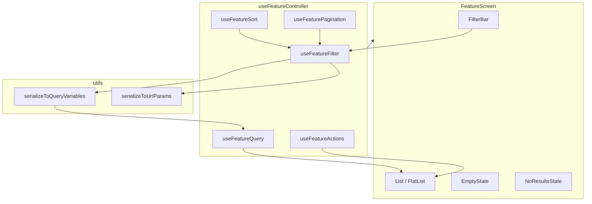
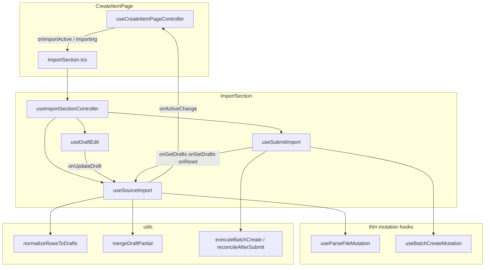

# Reference — React Feature Hook Architecture

Patterns **A** (list screen) and **B** (workflow section). See [SKILL.md](SKILL.md) for when to use each.

---

## Pattern A — List screen data flow



## Filter → query pipeline

1. User types in search → `onSearchChange` updates local input.
2. Debounce (typically 300ms) → updates persisted filter state (URL or state).
3. Filter change resets pagination cursor/page.
4. `useMemo` builds query variables from filter values via pure `serializeToQueryVariables`.
5. Query hook receives variables; Apollo/RQ refetches.

## File responsibilities

| File | Owns | Must not own |
|------|------|--------------|
| `useFeatureController` | Composition, derived flags (`loading`, `shouldShowList`) | JSX, column definitions |
| `useFeatureFilter` | Filter state, debounce, `on*` handlers, `isFiltering` | GraphQL documents |
| `useFeatureQuery` | Query/mutation hooks, `refetch`, error | UI components |
| `utils/*` | Serialization, defaults, type-safe param parsing | React hooks |
| `FilterBar` | Controlled inputs wired to filter handlers | Data fetching |
| `EmptyState` | CTA when no data exists globally | Filter awareness |
| `NoResultsState` | Message + clear filters when `isEmptyWithFilters` | Query variables |

## Controller return shape (extended)

```typescript
type FeatureController = {
  items: Item[];
  loading: boolean;
  refetching: boolean;
  error: Error | undefined;

  filter: {
    values: FilterValues;
    isFiltering: boolean;
    onSearchChange: (value: string) => void;
    onStatusChange: (status: Status | undefined) => void;
    onClearFilters: () => void;
    // …other on* handlers
  };

  pagination?: {
    pageSize: number;
    hasNextPage: boolean;
    onPageChange: (params: { after?: string; first?: number }) => void;
    onPageSizeChange: (size: number) => void;
  };

  sorting?: {
    field: SortField;
    direction: SortDirection;
    onSortChange: (field: SortField, direction: SortDirection) => void;
  };

  actions?: {
    onEdit: (id: string) => void;
    onDelete: (id: string) => void;
    // …
  };

  shouldShowList: boolean;
  isEmptyWithFilters: boolean;
};
```

Adapt names to the feature; keep the **semantic** split.

## Independent sections (tabs, modals)

When a route has **parallel flows** (Active vs History tabs):

```
FeatureScreen/
├── FeatureScreen.tsx          # tabs shell only
└── components/
    ├── ActiveItems/
    │   ├── ActiveItems.tsx
    │   └── hooks/
    │       ├── useActiveItemsController.ts
    │       ├── useActiveItemsFilter.ts
    │       └── useActiveItemsData.ts
    └── HistoryItems/
        └── …
```

Page-level controller stays minimal if sections do not share one filter tree.

Modal-only logic:

```
components/EditItemModal/
├── EditItemModal.tsx
└── hooks/
    └── useEditItemController.ts
```

Do not inflate the page controller with modal form state unless the page opens it globally.

## Debounce pattern (filter hook)

```typescript
const [searchInput, setSearchInput] = useState(initial);
const [debounced] = useDebouncedValue(searchInput, 300);

useEffect(() => {
  if (searchInput !== debounced) return;
  onPersistedFilterChange({ search: debounced || undefined, ...resetPagination });
}, [debounced, searchInput]);
```

Use project’s debounce utility (`useDebouncedValue`, `useDebouncedUrlSearch`, lodash debounce).

## Pagination reset constant

When any filter/sort changes, merge pagination defaults:

```typescript
const RESET_PAGE = { after: undefined, first: defaultPageSize };
onChange({ ...params, status, ...RESET_PAGE });
```

## When to extract shared components

Extract when:

- Same layout serves buyer + seller (or admin + user) with a `perspective` enum.
- Same filter bar + table used on two routes with different query hooks.

Keep wrapper thin at page level:

```typescript
// pages/History.tsx
const data = useSellerHistoryController();
return <HistoryListView perspective={Perspective.Seller} {...data} />;
```

---

## Pattern B — Workflow section data flow



## Callback wiring between domain hooks

| Callback | From | To | Why |
|----------|------|-----|-----|
| `onActiveChange(boolean)` | page | source hook | Hide sibling section while workflow has data |
| `onGetDrafts()` | controller | submit hook | Read latest drafts at click time, not hook mount time |
| `onSetDrafts(next)` | source → submit | After partial submit, update table rows |
| `onReset()` | source → submit | Clear all state after full success path |
| `onUpdateDraft(i, partial)` | source → edit | Edit hook delegates persistence to state owner |
| `drafts` (read) | source → edit | Derive `draft` for open modal index |

Controller glue (shape):

```typescript
const source = useSourceImport({ onActiveChange });
const onGetDrafts = useCallback(() => source.drafts, [source.drafts]);
const submit = useSubmitImport({
  onGetDrafts,
  onSetDrafts: source.onSetDrafts,
  onReset: source.reset,
});
const edit = useDraftEdit({ drafts: source.drafts, onUpdateDraft: source.onUpdateDraft });
return { source, submit, edit };
```

## Workflow file responsibilities

| File | Owns | Must not own |
|------|------|--------------|
| `useSourceImport` | `drafts` state, file upload, parse flow, counts, reset | Submit navigation, edit index |
| `useSubmitImport` | Submit handler, toasts, navigate on full success | Draft array state |
| `useDraftEdit` | `editingIndex`, modal open/close/save routing | Form fields, API client |
| `useParse*Mutation` / `useBatch*Mutation` | API document + mutation hook | Business rules |
| `utils/drafts.ts` | Status computation, merge, payload collection | React |
| `utils/submitExecution.ts` | Async execute + reconcile orchestration | Component JSX |
| `useEditModalController` (modal) | DTO ↔ form mapping, shared form controller | Draft list state |
| `useConfirmReset` (child) | Confirm dialog UX | Reset implementation |

## Derived state in source hook

Recompute counts from owned state with `useMemo` — do not store redundant `validCount` in separate state:

```typescript
const { validCount, invalidCount } = useMemo(() => {
  const invalid = drafts.filter((d) => d.status === Status.Fix).length;
  return { validCount: drafts.length - invalid, invalidCount: invalid };
}, [drafts]);
```

After every partial update, utils recompute row status (`mergeDraftPartial` → `computeDraftStatus`).

## Submit flow (imperative)

1. `onGetDrafts()` → current array.
2. `collectSubmitPayload(drafts)` in utils — skip if nothing ready.
3. `executeBatchCreate({ mutation, input })` — thin async wrapper.
4. `reconcileAfterSubmit({ drafts, payload, results })` — pure merge: successes removed, failures marked.
5. If no rows left → navigate + success toast; else `onSetDrafts(remaining)` + partial toast.

## Page + parallel sections

```
CreateItemPage/
├── CreateItemPage.tsx
├── hooks/useCreateItemPageController.ts   # ONLY cross-section flags
└── components/
    ├── ImportSection/                     # Pattern B self-contained
    └── ManualEntrySection/                # own useManualEntryController
```

**Rule:** if a subsection could be removed or feature-flagged without breaking the other, it gets its own `components/<Section>/hooks/` — not a growing page controller.

## Pattern A vs B — return shape

| Pattern | Controller return | View destructuring |
|---------|-------------------|-------------------|
| A — List | Flat: `{ listings, filter, pagination, … }` | Single feature, one query pipeline |
| B — Workflow | Namespaced: `{ source, submit, edit }` | Multiple domains composed; clearer wiring in JSX |
