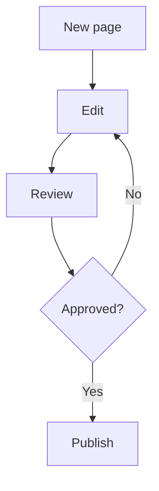

Paragraph. Type `/` to insert any block on this page.

## Heading 2

### Heading 3

> A quote with [a link](https://example.com).

***

* Bullet one
* Bullet two
  * Nested bullet

1. Numbered one
2. Numbered two

* [ ] To-do
* [x] Done

| Col A | Col B  |
| ----- | ------ |
| uno   | dos    |
| tres  | cuatro |

Lee la [guía](https://example.com/guide) y este  inline.


> [!NOTE]
>
> Note callout.

> [!TIP]
>
> Tip callout.

> [!IMPORTANT]
>
> Important callout.

> [!WARNING]
>
> Warning callout.

> [!CAUTION]
>
> Caution callout.

<details>
<summary>Toggle</summary>

Hidden until you open the toggle.

</details>

## Flowchart

GitHub and Slash MD render `mermaid` fences. Type `/diagram` to insert one.



## Code languages

One fence per language from `@codemirror/language-data`. The info string is the tag Slash MD uses for highlighting.

### C

```c
c
```

### C++

```cpp
cpp
```

### CQL

```cassandra
cassandra
```

### CSS

```css
css
```

### Go

```go
go
```

### HTML

```xhtml
xhtml
```

### Java

```java
java
```

### JavaScript

```ecmascript
ecmascript
```

### Jinja

```jinja
jinja
```

### JSON

```json5
json5
```

### JSX

```jsx
jsx
```

### LESS

```less
less
```

### Liquid

```liquid
liquid
```

### MariaDB SQL

```mariadbsql
mariadbsql
```

### Markdown

```markdown
markdown
```

### MS SQL

```mssql
mssql
```

### MySQL

```mysql
mysql
```

### PHP

```php
php
```

### PLSQL

```plsql
plsql
```

### PostgreSQL

```postgresql
postgresql
```

### Python

```python
python
```

### Rust

```rust
rust
```

### Sass

```sass
sass
```

### SCSS

```scss
scss
```

### SQL

```sql
sql
```

### SQLite

```sqlite
sqlite
```

### TSX

```tsx
tsx
```

### TypeScript

```ts
ts
```

### WebAssembly

```webassembly
webassembly
```

### XML

```rss
rss
```

### YAML

```yml
yml
```

### APL

```apl
apl
```

### PGP

```asciiarmor
asciiarmor
```

### ASN.1

```asn.1
asn.1
```

### Asterisk

```asterisk
asterisk
```

### Brainfuck

```brainfuck
brainfuck
```

### Cobol

```cobol
cobol
```

### C#

```csharp
csharp
```

### Clojure

```clojure
clojure
```

### ClojureScript

```clojurescript
clojurescript
```

### Closure Stylesheets (GSS)

```gss
gss
```

### CMake

```cmake
cmake
```

### CoffeeScript

```coffee
coffee
```

### Common Lisp

```lisp
lisp
```

### Cypher

```cypher
cypher
```

### Cython

```cython
cython
```

### Crystal

```crystal
crystal
```

### D

```d
d
```

### Dart

```dart
dart
```

### diff

```diff
diff
```

### Dockerfile

```dockerfile
dockerfile
```

### DTD

```dtd
dtd
```

### Dylan

```dylan
dylan
```

### EBNF

```ebnf
ebnf
```

### ECL

```ecl
ecl
```

### edn

```edn
edn
```

### Eiffel

```eiffel
eiffel
```

### Elm

```elm
elm
```

### Erlang

```erlang
erlang
```

### Esper

```esper
esper
```

### Factor

```factor
factor
```

### FCL

```fcl
fcl
```

### Forth

```forth
forth
```

### Fortran

```fortran
fortran
```

### F#

```fsharp
fsharp
```

### Gas

```gas
gas
```

### Gherkin

```gherkin
gherkin
```

### Groovy

```groovy
groovy
```

### Haskell

```haskell
haskell
```

### Haxe

```haxe
haxe
```

### HXML

```hxml
hxml
```

### HTTP

```http
http
```

### IDL

```idl
idl
```

### JSON-LD

```jsonld
jsonld
```

### Julia

```julia
julia
```

### Kotlin

```kotlin
kotlin
```

### LiveScript

```ls
ls
```

### Lua

```lua
lua
```

### mIRC

```mirc
mirc
```

### Mathematica

```mathematica
mathematica
```

### Modelica

```modelica
modelica
```

### MUMPS

```mumps
mumps
```

### Mbox

```mbox
mbox
```

### Nginx

```nginx
nginx
```

### NSIS

```nsis
nsis
```

### NTriples

```ntriples
ntriples
```

### Objective-C

```objective-c
objective-c
```

### Objective-C++

```objective-c++
objective-c++
```

### OCaml

```ocaml
ocaml
```

### Octave

```octave
octave
```

### Oz

```oz
oz
```

### Pascal

```pascal
pascal
```

### Perl

```perl
perl
```

### Pig

```pig
pig
```

### PowerShell

```powershell
powershell
```

### Properties files

```ini
ini
```

### ProtoBuf

```protobuf
protobuf
```

### Pug

```jade
jade
```

### Puppet

```puppet
puppet
```

### Q

```q
q
```

### R

```rscript
rscript
```

### RPM Changes

```rpmchanges
rpmchanges
```

### RPM Spec

```spec
spec
```

### Ruby

```jruby
jruby
```

### SAS

```sas
sas
```

### Scala

```scala
scala
```

### Scheme

```scheme
scheme
```

### Shell

```bash
bash
```

### Sieve

```sieve
sieve
```

### Smalltalk

```smalltalk
smalltalk
```

### Solr

```solr
solr
```

### SML

```sml
sml
```

### SPARQL

```sparul
sparul
```

### Spreadsheet

```excel
excel
```

### Squirrel

```squirrel
squirrel
```

### Stylus

```stylus
stylus
```

### Swift

```swift
swift
```

### sTeX

```stex
stex
```

### LaTeX

```tex
tex
```

### SystemVerilog

```systemverilog
systemverilog
```

### Tcl

```tcl
tcl
```

### Textile

```textile
textile
```

### TiddlyWiki

```tiddlywiki
tiddlywiki
```

### Tiki wiki

```tikiwiki
tikiwiki
```

### TOML

```toml
toml
```

### Troff

```troff
troff
```

### TTCN

```ttcn
ttcn
```

### TTCN_CFG

```ttcn_cfg
ttcn_cfg
```

### Turtle

```turtle
turtle
```

### Web IDL

```webidl
webidl
```

### VB.NET

```vb.net
vb.net
```

### VBScript

```vbscript
vbscript
```

### Velocity

```velocity
velocity
```

### Verilog

```verilog
verilog
```

### VHDL

```vhdl
vhdl
```

### XQuery

```xquery
xquery
```

### Yacas

```yacas
yacas
```

### Z80

```z80
z80
```

### MscGen

```mscgen
mscgen
```

### Xù

```xù
xù
```

### MsGenny

```msgenny
msgenny
```

### Vue

```vue
vue
```

### Angular Template

```angulartemplate
angulartemplate
```
