# Flujos — Slash MD

Cómo deben usarse los flujos del producto: **quién hace qué**, **en qué superficie** (Home vs editor), y **qué pasa bajo el capó**.

**VS Code / Cursor** es solo el editor Markdown (`Open with Slash MD`). **Desktop** es la wiki: Home, publicaciones, review, publish.

Guía de instalación y UI: [USAGE.md](USAGE.md). Mapa técnico host ↔ webview: [ARCHITECTURE.md](ARCHITECTURE.md). Lectura publicada: [READING.md](READING.md).

---

## 1. Elegir el modo

El modo vive en `.slashmd.json` (`mode`). Define el ciclo de publicación entero.

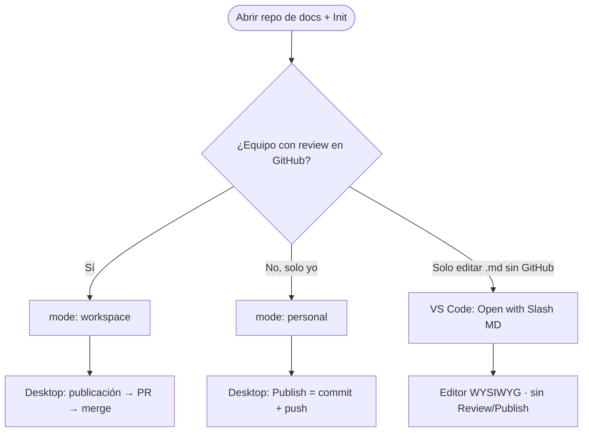

| Modo | Cuándo usarlo | Review | Publish |
|------|---------------|--------|---------|
| **Workspace** (default) | Docs de equipo, branch protection, CODEOWNERS | **Enviar a revisión** desde una publicación (`pub/…`) → PR | **Publicar** = merge + volver a `defaultBranch` |
| **Personal** | Repo solo, sin PR obligatorio | No hay | Barra del editor → push a `defaultBranch` |
| **Editor** (VS Code) | Solo WYSIWYG en el IDE | No | No |

**Regla de oro (wiki + Workspace):** en `defaultBranch` la wiki es **solo lectura**. Para escribir: **Nueva publicación** → editar → **Enviar a revisión** → **Publicar**.

---

## 2. Ciclo principal — Workspace (publicación = rama)

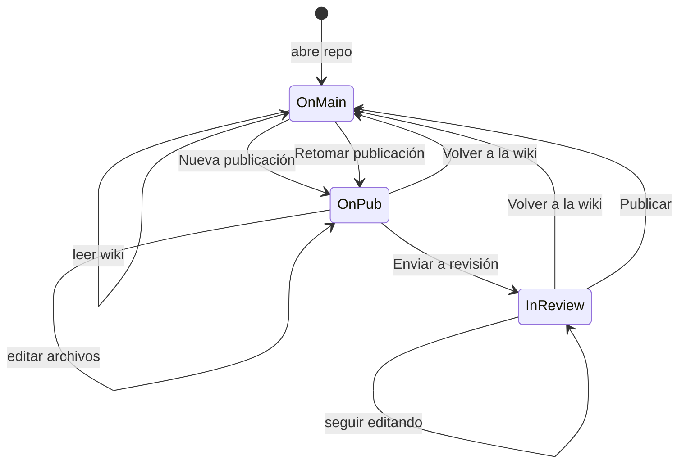

### Pasos de uso

| # | Quién | Dónde | Acción |
|---|-------|-------|--------|
| 1 | Autor | Home | **Nueva publicación** (título) → checkout `pub/YYYY-MM-DD-<slug>` |
| 2 | Autor | Home / editor | Nueva página, editar, propiedades (`people`, `tags`) |
| 3 | Autor | Home / editor | **Enviar a revisión** → preview (excluir archivos) → PR |
| 4 | Reviewer | GitHub PR | Approves / comenta |
| 5 | Autor | Home → **Feedback** | Abre comentario en el canvas |
| 6 | Autor | Home / banner | **Publicar** cuando el PR esté listo → merge + checkout `defaultBranch` |

### Diagrama de secuencia (publicación → PR)

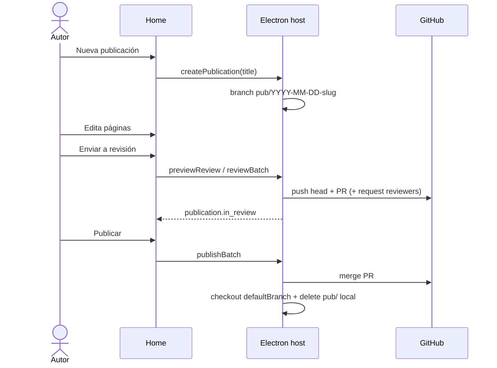

### Ciclo de vida (derivado, no YAML)

| Estado | Cómo se deriva | Significado |
|--------|----------------|------------|
| Wiki publicada | `HEAD === defaultBranch` | Solo lectura |
| Borrador de publicación | Rama `pub/…` sin PR abierto (o dirty) | Se puede editar |
| En revisión | Publicación montada con PR abierto | Se puede seguir editando y re-enviar |
| Publicado | Merge + vuelta a `defaultBranch` | Limpio en la wiki |

Los campos de contenido (`title`, `icon`, `cover`, `tags`, `people`) se escriben en el frontmatter **dentro** de una publicación. La app **no** escribe `status` / `pr` / `reviewBranch` en el camino feliz (sigue tolerando valores heredados al leer).

---

## 3. Publicar — Workspace

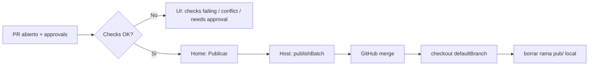

**Cómo usarlo**

1. La aprobación de contenido sigue siendo en GitHub.
2. Cuando el PR cumple reglas, usa **Publicar** (banner de publicación o Home).
3. Si está bloqueado, lee el motivo (`needs approval`, `checks failing`, `conflict`, sin sesión GitHub).

---

## 4. Ciclo Personal

Sin PR. Un solo botón en la barra del editor.

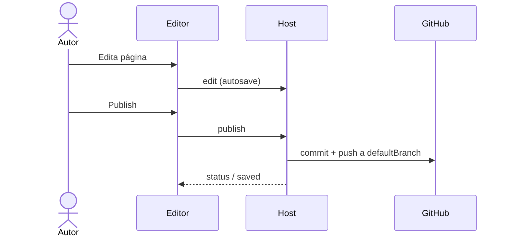

**Cómo usarlo**

- Repo personal o sandbox sin branch protection estricta.
- Si `main` exige PR / bloquea push directo → cambia a **Workspace** o relaja la protección.

---

## 5. Wiki desde el editor → publicación (Workspace)

Sin publicación montada, el editor es solo lectura (título, canvas, icon/cover, imágenes).

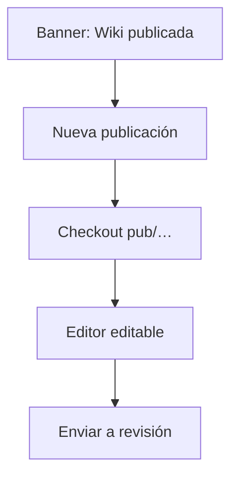

**Cómo usarlo**

- Lee la wiki en `main` (u otra `defaultBranch`).
- Crea o retoma una publicación para escribir.
- **Enviar a revisión** / **Publicar** desde el banner de Home o el menú del editor (con publicación montada).

---

## 6. Feedback e inbox

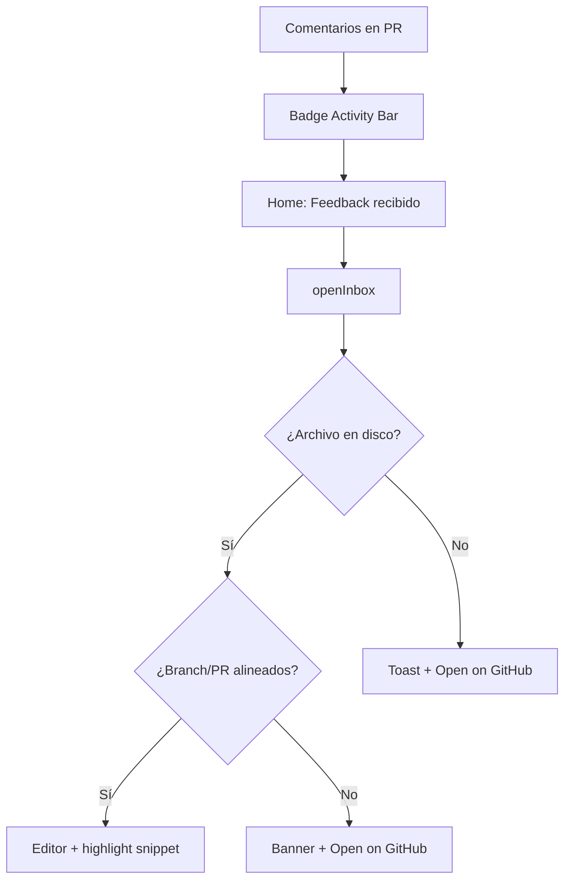

**Cómo usarlo**

1. No cambies de branch a mano solo para “ver el comentario”.
2. Si el banner aparece, el trabajo local no se toca; abre el contexto en GitHub o alinea el PR cuando puedas.
3. Threads sin ancla de texto van al rail **Off canvas** / Unanchored.

---

## 7. Comentarios en el canvas

Solo **Workspace** + publicación con PR abierto.

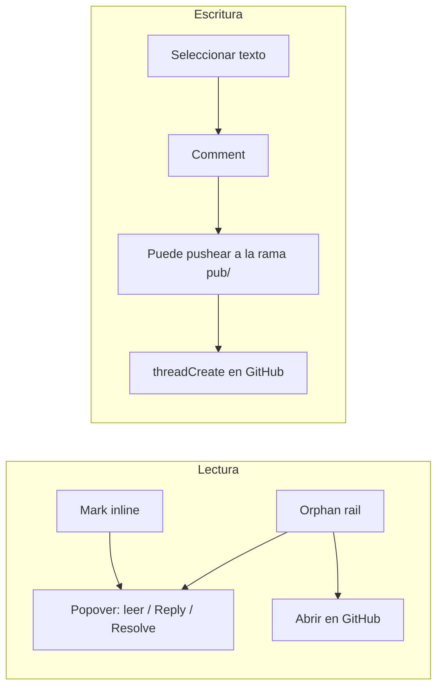

**Cómo usarlo**

| Acción | Uso correcto |
|--------|----------------|
| Click en mark | Leer hilo sin salir del doc |
| Reply / Resolve | Requiere write en el repo |
| Comment desde selección | Puede subir commits pendientes a la rama de la publicación |
| Personal / sin PR | Comments apagados |

---

## 8. Autosave y sync externo

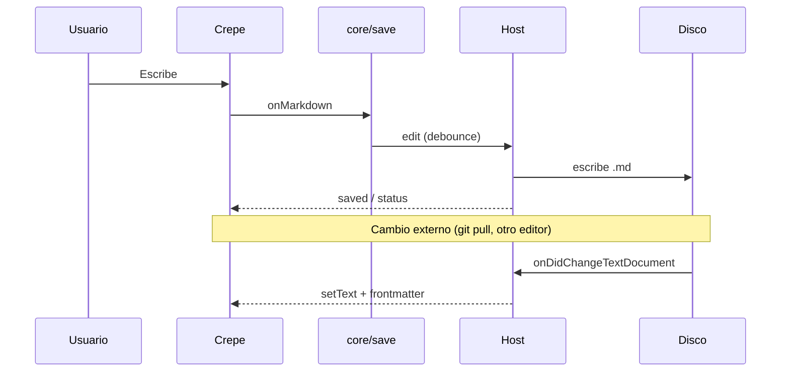

**Cómo usarlo**

- Confía en el archivo del workspace: es la fuente de verdad.
- Autosave solo escribe con publicación montada (Workspace).
- Imágenes: van a `{contentPath}/images/` con paths relativos; entran en el PR al enviar a revisión.

---

## 9. Superficies: qué hacer dónde

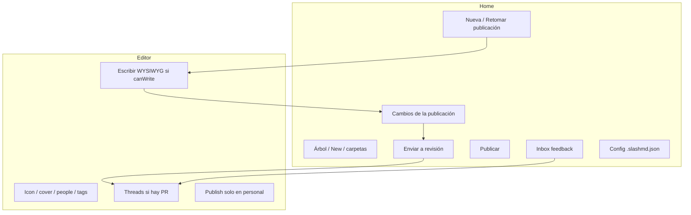

| Quiero… | Usar |
|---------|------|
| Empezar a escribir (Workspace) | Home → **Nueva publicación** |
| Crear página / carpeta | Solo con publicación montada |
| Escribir y formatear | Editor (`canWrite`) |
| Ver cambios de la publicación | Home → Borradores / cambios |
| Ver PR de la publicación | Home → En revisión |
| Responder un comentario | Editor (desde Inbox o marks) |
| Mergear tras approval | Home → **Publicar** |
| Push directo (personal) | Editor → Publish |
| Solo editar un `.md` suelto | Open with Slash MD |

---

## 10. Mensajes técnicos (mapa rápido)

Para auditar o extender el código; el detalle está en [ARCHITECTURE.md](ARCHITECTURE.md).

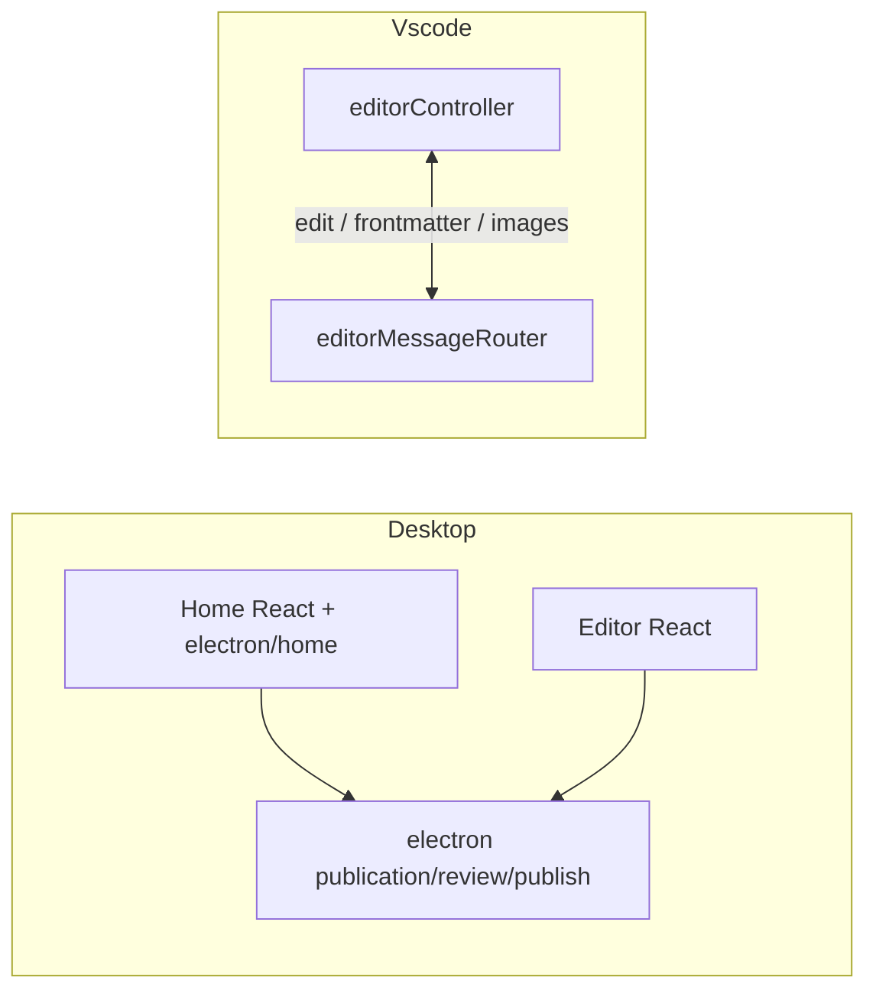

| Flujo de producto | Mensajes clave |
|-------------------|----------------|
| Cargar Home | `ready` → `tree` (+ `publication` / `canWrite`) |
| Publicaciones | `createPublication` / `resumePublication` / `leavePublication` / `listPublications` |
| Review | `previewReview` → `reviewBatch(reviewers?, excludePaths?)` |
| Publicar | `publishBatch` |
| Abrir feedback | `openInbox` → `revealThread` / `reviewContext` |
| Autosave | `edit` / `frontmatter` → `saved` |
| Threads | `threadsRefresh` / `threads` / `threadReply` / `threadResolve` |

---

## 11. Anti-patrones

| Evitar | Hacer en su lugar |
|--------|-------------------|
| Editar en `defaultBranch` (Workspace) | Crear o retomar una publicación |
| Esperar un lote mensual `review/docs-YYYY-MM` | Una publicación = una rama `pub/…` = un PR |
| Escribir `status` / `pr` a mano para “mandar a review” | **Enviar a revisión** desde la UI |
| Usar Personal con `main` protegido | Workspace, o relajar protección |
| Tratar el sidecar `.slash.md` como el camino feliz nuevo | Wiki `.md` bajo `contentPath` |

---

## 12. Checklist de adopción (equipo)

1. Repo de docs abierto como carpeta + **Init** (`mode: workspace`).
2. Branch protection + reviewers en GitHub.
3. Autor: **Nueva publicación** → escribe → **Enviar a revisión**.
4. Reviewer: aprueba/comenta en GitHub (y/o threads en canvas).
5. Autor: Inbox → corrige → re-envía al mismo PR si hace falta.
6. **Publicar** → lectores en GitHub / Pages ([READING.md](READING.md)).
