# Flujos — Slash MD

Cómo deben usarse los flujos del producto: **quién hace qué**, **en qué superficie** (Home vs editor), y **qué pasa bajo el capó**.

Guía de instalación y UI: [USAGE.md](USAGE.md). Mapa técnico host ↔ webview: [ARCHITECTURE.md](ARCHITECTURE.md). Lectura publicada: [READING.md](READING.md).

---

## 1. Elegir el modo

El modo vive en `.slashmd.json` (`mode`). Define el ciclo de publicación entero.

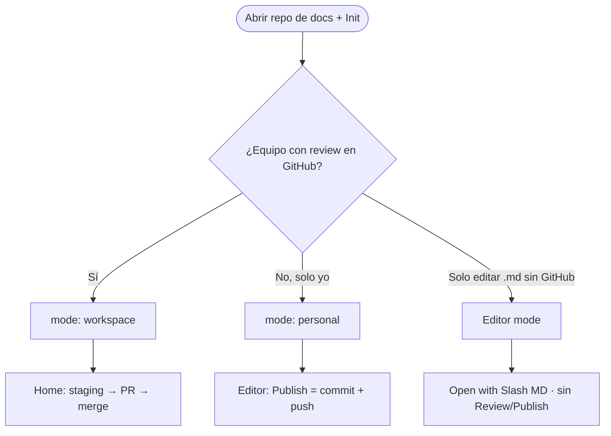

| Modo | Cuándo usarlo | Review | Publish |
|------|---------------|--------|---------|
| **Workspace** (default) | Docs de equipo, branch protection, CODEOWNERS | Home: **Mandar a Revisión** → PR | Home: **Aprobar y Publicar** tras approval |
| **Personal** | Repo solo, sin PR obligatorio | No hay | Barra del editor → push a `defaultBranch` |
| **Editor** | Fuera del wiki, o solo WYSIWYG | No | No |

**Regla de oro (wiki + Workspace):** escribe en el **editor**; manda a revisión y publica solo desde **Home**.

---

## 2. Ciclo principal — Workspace (local-first)

Flujo recomendado para documentación de producto.

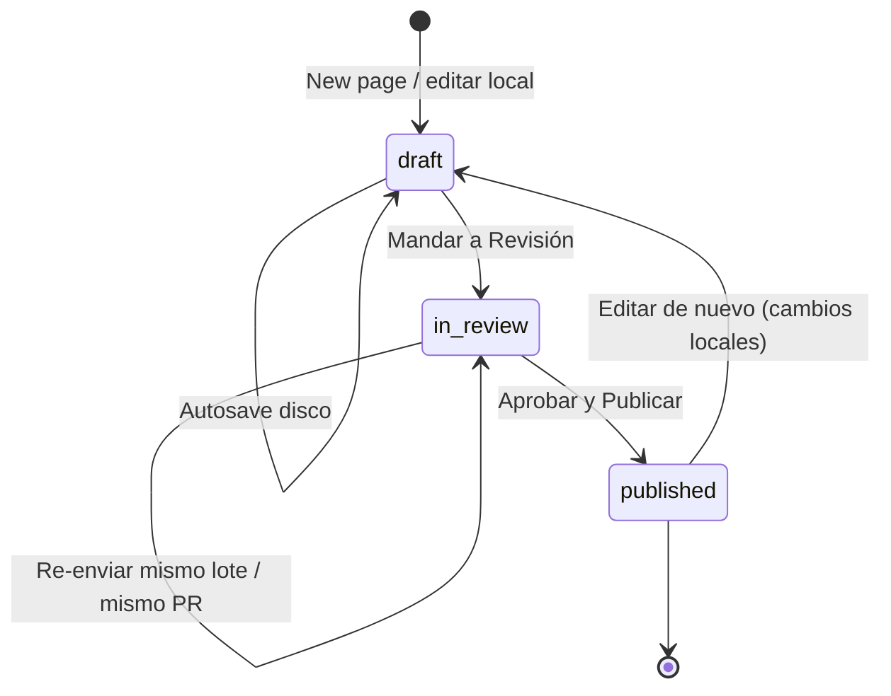

### Pasos de uso

| # | Quién | Dónde | Acción |
|---|-------|-------|--------|
| 1 | Autor | Home → **New page** | Plantilla + título → `.md` con `status: draft` |
| 2 | Autor | Editor | Escribe; autosave ~300 ms al disco |
| 3 | Autor | Home → **Borradores locales** | Checkbox del lote |
| 4 | Autor | Home | **Mandar a Revisión** → preview → confirmar |
| 5 | Reviewer | GitHub PR | Approves / comenta |
| 6 | Autor | Home → **Feedback recibido** | Abre comentario en el canvas |
| 7 | Autor / merge | Home | **Aprobar y Publicar** cuando el PR esté listo |

### Diagrama de secuencia (staging → PR)

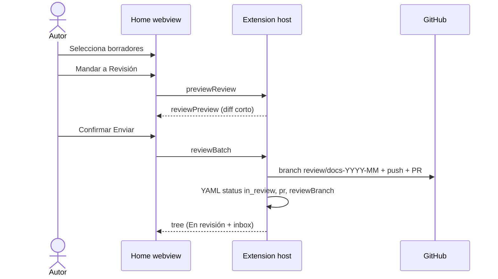

### Frontmatter del ciclo

| Estado | YAML típico | Significado |
|--------|-------------|-------------|
| Borrador | `status: draft` | Solo local / modificado |
| En revisión | `status: in_review` + `pr` + `reviewBranch` | Página en el lote del PR |
| Publicado | `status: published` (sin `pr` / `reviewBranch`) | Mergeado a `defaultBranch` |

---

## 3. Publicar — Workspace

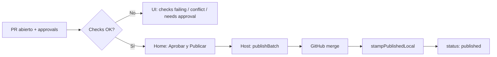

**Cómo usarlo**

1. No apruebes el merge “a ciegas” desde la extensión: la aprobación de **contenido** sigue siendo en GitHub.
2. Cuando el PR cumple reglas (reviewers, checks), usa **Aprobar y Publicar** en Home.
3. Si está bloqueado, lee el motivo en la tarjeta **En revisión** (`needs approval`, `checks failing`, `conflict`, sin sesión GitHub).

---

## 4. Ciclo Personal

Sin PR. Un solo botón en la barra del editor.

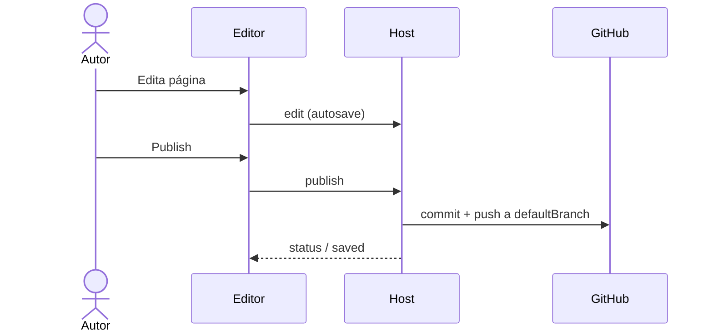

**Cómo usarlo**

- Repo personal o sandbox sin branch protection estricta.
- Si `main` exige PR / bloquea push directo → cambia a **Workspace** o relaja la protección.

---

## 5. Wiki desde el editor → Home (Workspace)

En páginas wiki (`pageKind === wiki`), Review/Publish **no** viven en la barra como flujo completo.

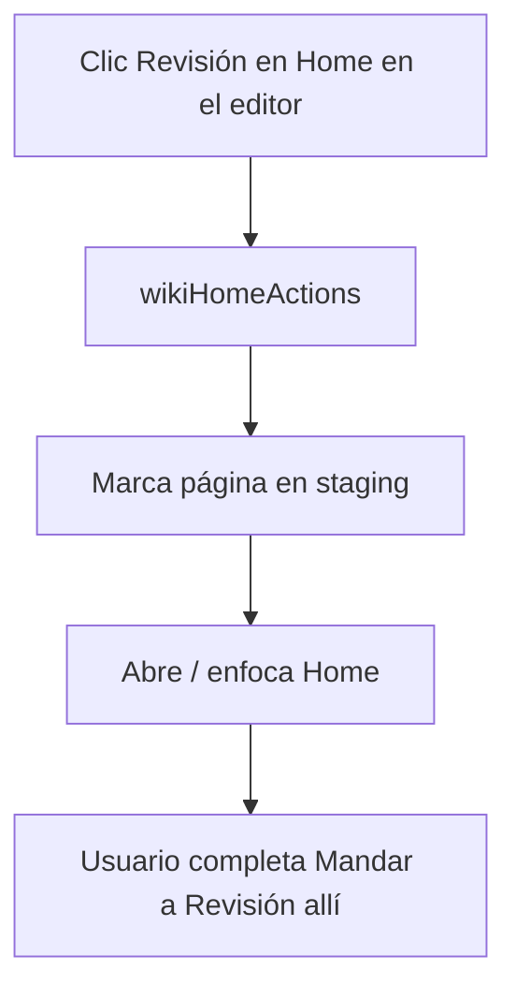

**Cómo usarlo**

- Escribe y guarda en el editor.
- Para el lote: ve a Home (o usa el CTA de la barra que te lleva allí).
- Publicar el merge: solo Home → **Aprobar y Publicar**.

Los sidecars legacy (`.slash.md`) sí pueden Review/Publish desde la barra.

---

## 6. Feedback e inbox

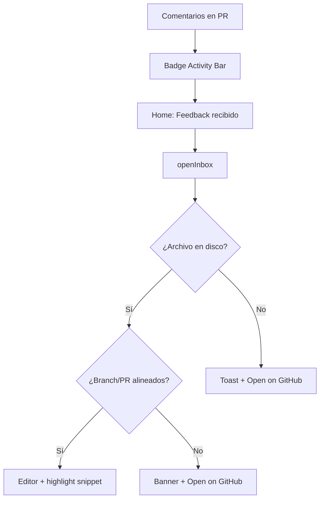

**Cómo usarlo**

1. No cambies de branch a mano para “ver el comentario”: la extensión **no** hace checkout.
2. Si el banner aparece, el trabajo local no se toca; abre el contexto en GitHub o alinea el PR cuando puedas.
3. Threads sin ancla de texto van al rail **Off canvas** / Unanchored.

---

## 7. Comentarios en el canvas

Solo **Workspace** + página con PR abierto (`in_review` + threads cargables).

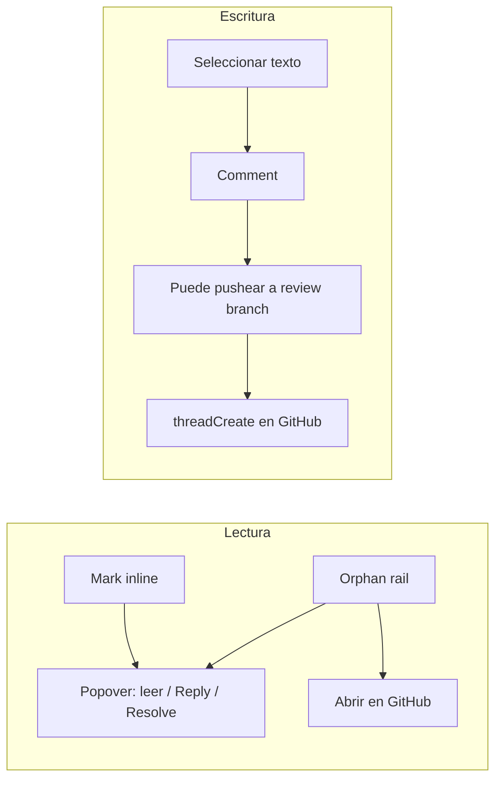

**Cómo usarlo**

| Acción | Uso correcto |
|--------|----------------|
| Click en mark | Leer hilo sin salir del doc |
| Reply / Resolve | Requiere write en el repo |
| Comment desde selección | Puede subir commits pendientes al branch de review primero |
| Personal / sin PR | Comments apagados — no esperes UI de hilos |

---

## 8. Autosave y sync externo

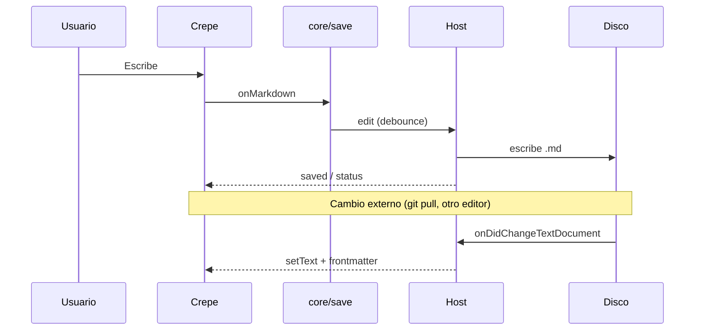

**Cómo usarlo**

- Confía en el archivo del workspace: es la fuente de verdad.
- No hay “guardar borrador en la nube” aparte de Git/GitHub en Review/Publish.
- Imágenes: van a `{contentPath}/images/` con paths relativos; entran en el lote al mandar a revisión.

---

## 9. Superficies: qué hacer dónde

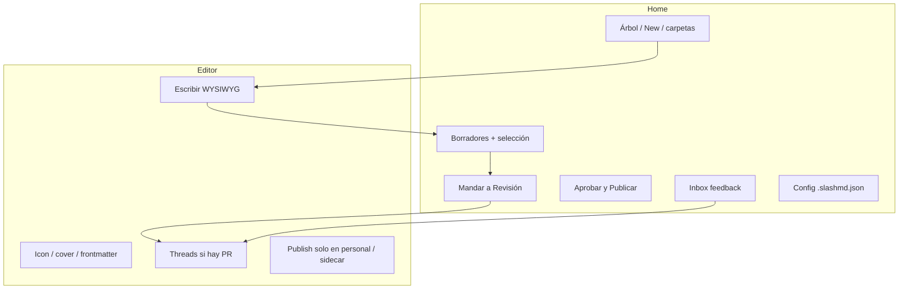

| Quiero… | Usar |
|---------|------|
| Crear página / carpeta | Home |
| Escribir y formatear | Editor |
| Armar lote de review | Home → Borradores |
| Ver estado del PR del lote | Home → En revisión |
| Responder un comentario de review | Editor (desde Inbox o marks) |
| Mergear tras approval | Home |
| Push directo (personal) | Editor → Publish |
| Solo editar un `.md` suelto | Open with Slash MD |

---

## 10. Mensajes técnicos (mapa rápido)

Para auditar o extender el código; el detalle está en [ARCHITECTURE.md](ARCHITECTURE.md).

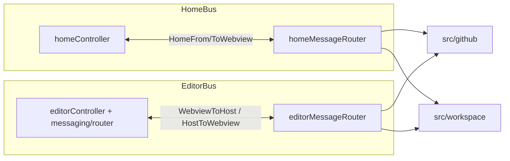

| Flujo de producto | Mensajes clave |
|-------------------|----------------|
| Cargar Home | `ready` → `tree` |
| Staging → review | `previewReview` → `reviewPreview` → `reviewBatch` |
| Publicar lote | `publishBatch` |
| Abrir feedback | `openInbox` → `revealThread` / `reviewContext` |
| Autosave | `edit` / `frontmatter` → `saved` |
| Threads | `threadsRefresh` / `threads` / `threadReply` / `threadResolve` |

---

## 11. Anti-patrones

| Evitar | Hacer en su lugar |
|--------|-------------------|
| Esperar Review/Publish completo en la barra del wiki (Workspace) | Usar Home |
| Hacer checkout a mano solo para ver un comentario del inbox | Abrir desde Feedback; usar GitHub si hay mismatch |
| Mezclar páginas de PRs distintos en un solo “Aprobar y Publicar” sin revisar la tarjeta | Un lote / un PR dominante; la UI pide elegir si hay varios |
| Usar Personal con `main` protegido | Workspace, o relajar protección |
| Tratar el sidecar `.slash.md` como el camino feliz nuevo | Wiki `.md` bajo `contentPath` |

---

## 12. Checklist de adopción (equipo)

1. Repo de docs abierto como carpeta + **Init** (`mode: workspace`).
2. Branch protection + reviewers en GitHub.
3. Autor: New page → escribe → Mandar a Revisión.
4. Reviewer: aprueba/comenta en GitHub (y/o threads en canvas).
5. Autor: Inbox → corrige → re-envía al mismo PR si hace falta.
6. **Aprobar y Publicar** → lectores en GitHub / Pages ([READING.md](READING.md)).
