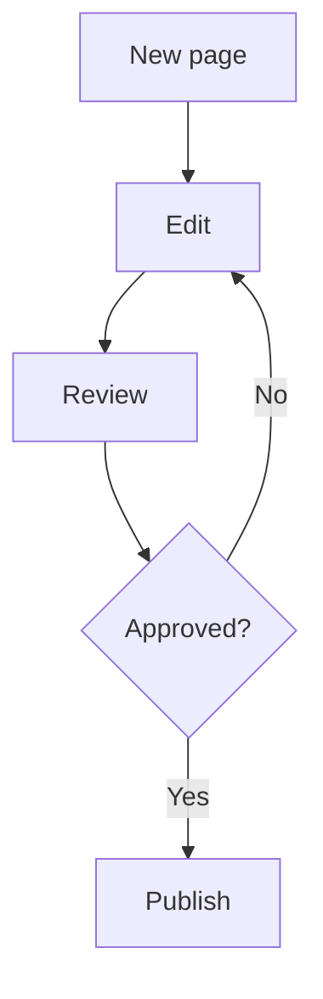

# Gallery

Paragraph. Type `/` to insert any block on this page.

## Heading 2

### Heading 3

> A quote with [a link](https://example.com).

***

* Bullet one
* Bullet two
  * Nested bullet

1. Numbered one
2. Numbered two

* [ ] To-do
* [x] Done

| Col A | Col B |
| - | - |
| uno | dos |
| tres | cuatro |

Lee la [guía](https://example.com/guide) y este  inline.

> [!NOTE]
>
> Note callout.

> [!TIP]
>
> Tip callout.

> [!IMPORTANT]
>
> Important callout.

> [!WARNING]
>
> Warning callout.

> [!CAUTION]
>
> Caution callout.

Toggle

Hidden until you open the toggle.

## Flowchart

GitHub and Slash MD render `mermaid` fences. Type `/diagram` to insert one.

